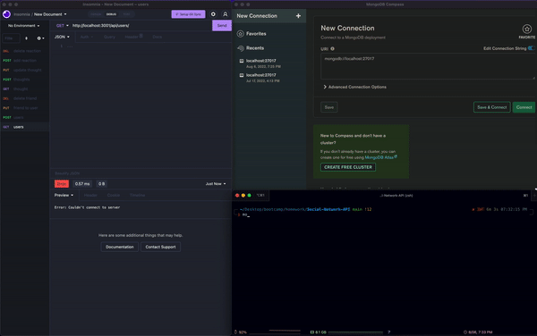
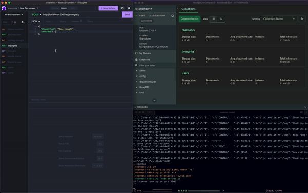

# Social Network API

  This is a fully backend project that mimmics the main functions of a social media app.

  [](https://opensource.org/licenses/MIT)

---

## Contents 🗒

1. [About](#about)
    1. [User Story](#user%20story)
    2. [Acceptance criteria](#acceptance%20criteria)
    3. [Project Preview](#project%20preview)
2. [Installation](#installation)
3. [Technologies](#technologies)
4. [License](#license)
5. [Contributing](#contributing)
6. [Authors and acknowledgment](#authors%20and%20acknowledgment)
7. [Contacts](#contacts)

---

## About 📋

This backend social network application has most of the basic functions of any social media apps out in the market at the moment. the main functions of this project are: adding, updating, and delete a user, a thought, and adding friends to users.

---

## User Story 👩🏻‍🏫

```md
AS A social media startup
I WANT an API for my social network that uses a NoSQL database
SO THAT my website can handle large amounts of unstructured data
```

---

## Acceptance Criteria 🌈

```md
GIVEN a social network API
WHEN I enter the command to invoke the application
THEN my server is started and the Mongoose models are synced to the MongoDB database
WHEN I open API GET routes in Insomnia for users and thoughts
THEN the data for each of these routes is displayed in a formatted JSON
WHEN I test API POST, PUT, and DELETE routes in Insomnia
THEN I am able to successfully create, update, and delete users and thoughts in my database              
WHEN I test API POST and DELETE routes in Insomnia
THEN I am able to successfully create and delete reactions to thoughts and add and remove friends to a user’s friend list
```

---

## Project Preview 📸




---

## Installation 📀

  Clone repo, run npm init, install dependencies, run node

  To clone the repo:

    git clone 
    
    git@github.com:vynguyen205/Social-Network-API.git

---

## Technologies 👩🏻‍🔧

- Express
- Node
- MongoDB
- Mongoose ODM

---

## License 👮🏻‍♀️
  License used for this project - MIT
  * For more information on license types, please reference this website
  for additional licensing information - [https: //choosealicense.com/](https://choosealicense.com/).

---

## Contributing 💃🏻

To contribute to this application, create a pull request.
  Here are the steps needed for doing that:
  - Fork the repo
  - Create a feature branch (git checkout -b NAME-HERE)
  - Commit your new feature (git commit -m 'Add some feature')
  - Push your branch (git push)
  - Create a new Pull Request
  Following a code review, your feature will be merged.

---

## Links 🔗 

**[GitHub Link 🐱](https://github.com/vynguyen205/Social-Network-API)**

<br>

**[Youtube Demo 👀](https://youtu.be/6drk0lNDLMk)**

---

## Usage Instructions 💻

1. Clone the repo 2. install dependencies, do 'npm i' 3. make sure your MAMP or whatever else you use is running 4. run 'node server'

---

## Authors and Acknowledgments ✨

Built by Vy Nguyen

---

## Contacts ☎️

- GitHub Username: [vynguyen205](https://github.com/vynguyen205)
- GitHub Email: vynguyen0520@gmail.com
  
